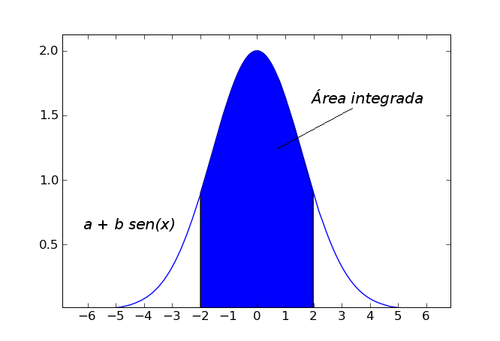

Cálculo Numérico
================

Aunque el paquete **Numpy** ofrece ciertas funcionalidades matemáticas además de la manipulación básica de arrays, como el paquete **linalg** para álgebra lineal y **random** para números aleatorios, en **Scipy** encontraremos todas las herramientas matemáticas que podamos necesitar. **Scipy** es una colección de paquetes de algoritmos y herramientas matemáticas para distintas tareas, que también utiliza Numpy. Scipy posee varios subpaquetes que deben importarse independientemente cuando se vayan a utilizar; éstos son algunos de ellos:

===========   =======================================================
Subpaquete    Descripción
===========   =======================================================
odr           Regresión de distancias ortogonales (ODR) 
misc          Funciones varias (lectura de imagenes, factorial, etc.)
fftpack       Algoritmos para transformada de Fourier discreta
io            Entrada y salida de datos
stats         Funciones estadisticas
lib           Envoltorios (*wrappers*) de Python a librerías externas
integrate     Integración numérica
ndimage       Imagenes n-dimensionales
linalg        Álgebra lineal
interpolate   Herramientas de interpolación
optimize      Herramientas de optimización 
signal        Tratamiento de señales
===========   =======================================================

Para ver la lista completa de subpaquetes consultar la ayuda de scipy como **help(scipy)** (haciendo antes **import scipy** para tener todos los nombres asociados a scipy) y consultar su página web para ver la documentación completa (``www.scipy.org``). Una manera práctica de trabajar es importar el espacio de nombres de scipy, es decir el nombre de sus paquetes y funciones principales y luego importar el o los paquetes que vaya a usar, como en este ejemplo:

.. sourcecode:: python
   
   from scipy import *         # importa el nombre de los subpaquetes únicamente
   import optimize, stats      # importa los paquete optimize y stats 

Integración numérica
--------------------

El subpaquete **integrate** ofrece varias herramientas de integración numérica con distintos métodos. Podemos ver todos los disponibles consultando su ayuda:

.. sourcecode:: python

 >>> from scipy import *

 >>> help(integrate)

 Integration routines
 ====================

 Methods for Integrating Functions given function object.

   quad          -- General purpose integration.
   dblquad       -- General purpose double integration.
   tplquad       -- General purpose triple integration.
   fixed_quad    -- Integrate func(x) using Gaussian quadrature of order n.
   quadrature    -- Integrate with given tolerance using Gaussian quadrature.
   romberg       -- Integrate func using Romberg integration.

 Methods for Integrating Functions given fixed samples.

   trapz         -- Use trapezoidal rule to compute integral from samples.
   cumtrapz      -- Use trapezoidal rule to cumulatively compute integral.
   simps         -- Use Simpson's rule to compute integral from samples.
   romb          -- Use Romberg Integration to compute integral from
                    (2**k + 1) evenly-spaced samples.

   See the special module's orthogonal polynomials (special) for Gaussian
      quadrature roots and weights for other weighting factors and regions.

 Interface to numerical integrators of ODE systems.

   odeint        -- General integration of ordinary differential equations.
   ode           -- Integrate ODE using VODE and ZVODE routines.

Existen por ejemplo implementaciones del método del trapecio o el método de Simpsom, ambos métodos simples basados en muestras fijas. Las funciones **trapz()** y **simps()**, que emplean dichos métodos para al cálculo numérico de integrales, adminten como entrada un array *y* de valores a integrar y otro array con la variable independiente *x*; si no se incluye un segundo parámetro, el espaciado entre los elementos de *y* de 1 por defecto, aunque este valor se puede asignar con el parámetro opcional *dx=1*. 

Supongamos que queremos integrar numéricamente la función *sen(x)* de 0 a :math:`pi`, cuyo valor exacto es 2. Veamos cómo se puede calcular numéricamente con distinto número de muestras:

.. sourcecode:: ipython
   
   In [3]: from scipy import integrate

   #  Generamos 5 muestras de la función seno, de 0 a pi
   In [9]: x = linspace(0, pi, 5)          
   In [10]: y = sin(x)

   # Integramos el array por el método del trapecio
   In [11]: integrate.trapz(y,x)
   Out[11]: 1.8961188979370398

   # Si aunmentamos el número de muestras,
   # la intragración se acerca más al valor analítico

   #  Generamos 20 muestras de la función seno, de 0 a pi
   In [12]: x = linspace(0, pi, 20)
   In [13]: y = sin(x)

   # Integramos el array por el método del trapecio
   In [14]: integrate.trapz(y,x)
   Out[14]: 1.9954413183201947

   # Integramos por el método de Simpson
   In [16]: integrate.simps(y,x)
   Out[16]: 1.999977188106568

.. image:: img/plot_trapecio.png
  :align: center
  :width: 14cm

Como se ve, el método de Simpson da un valor más cercano al verdadero, que del trapecio, ya que el primero emplea polinomios de grado 2 para la integración.

En la prática, la función de uso general más eficiente es **quad(func, a, b)**, que integra por cuadratura de Clenshaw-Curtis [#]_ una función de Python **func** entre *a* y *b*. Consideremos como ejemplo el cálculo del área una semicircunferencia de radio unidad calculando la integral bajo la curva. Para ello definimos una función de circunferencia e integramos entre -1 y 1:

.. [#] Para detalles, ver por ejemplo http://en.wikipedia.org/wiki/Clenshaw-Curtis_quadrature

.. sourcecode:: ipython

   # Definimos la funcion a integrar
   In [17]: def semicirculo(x):
              return sqrt(1 - x**2)

   # Integramos numéricamente entre -1 y +1
   In [18]: intg, err = integrate.quad(semicirculo, -1.0, 1.0)

   # Comprobamos que el resultado es correcto (pi/2)
   In [19]: print(intg*2)
   3.14159265359

La función **quad()** devuelve por defecto el valor de la integral, que en este caso vale :math:`\frac{1}{2}\pi` y una estimación del error en el proceso de integración numérica. Los límites de integración pueden ser :math:`+\infty` o :math:`-\infty` usando los símbolos *+Inf* o *-Inf*:

.. sourcecode:: python

   def func1(x):
       return 2.0*exp(-x**2/5.)

   int1, err1 = integrate.quad(func1, -2, +2)           # integración entre -2 y +2
   int2, err2 = integrate.quad(func1, -Inf, +Inf)       # integración entre -infinito y +infinito

   print(int1, int2)
   (6.294530963693763, 7.9266545952120211)

Es posible incluir varios parámetros a la función empleando el parámetro opcional *args* como una tupla de parámetros (ver la ayuda de **quad()**:

.. sourcecode:: ipython

   # Definimos la función a integrar, incluyendo parámetros
   In [36]: def f2(x,a,b):
              return a+ b*sin(x)

   # Definimos unos parámetros de entrada
   In [37]: p=0.2;q=1

   # Integramos numéricamente, incluyendo parámetros 
   In [38]: integrate.quad(f2, 0, pi, args=(p,q))
   (2.6283185307179586, 2.9180197488520396e-14)

Se pueden calcular integrales dobles empleando de manera similar **dblquad()**, aunque los límites de la segunda integral se deben poner como funciones de Python.

.. sourcecode:: python
   
   # Función a integrar
   def f1(x,y):
      return x+y
   
   # Límites de la primera integral
   a, b = 0, 2

   # Definición de limites de segunda integral
   def gfun(x):
      return 0

   def hfun(x):
      return 10

   integrate.dblquad(f1, 0, 2, gfun, hfun)
   # Resultado: (120.00000000000001, 1.3322676295501881e-12)

Álgebra matricial
-----------------

Una maneras de ver *arrays* bidimensionales de **Numpy** es como matrices, aunque en realidad los *arrays*, cuando se opera algebraicamente con ellos, no se manipulan como matrices. Por ejemplo el producto de dos arrays bidimensionales **NxM** se raliza elemento a elemento y no como un producto algebraico de matrices. Veamos unos ejemplos::

	>>> # Dos matrices nxn
	>>> A = array([[3, 6, 7], [2, 6, 2], [10, 9, 1]])
	>>> B = array([[4, 5, 5], [8, 3, 4], [3, 11, 2]])

	>>> print(A)
	[[ 3  6  7]
	 [ 2  6  2]
	 [10  9  1]]

	>>> print(B)
	[[ 4  5  5]
	 [ 8  3  4]
	 [ 3 11  2]]

	>>> # Producto elemento a elemento entre matrices
	>>> print(A*B)
	[[12 30 35]
	 [16 18  8]
	 [30 99  2]]

Sin embargo **Numpy** permite hacer el producto punto entre matrices con la función ``dot()``::

	>>> # Producto punto entre matrices
	>>> print(dot(A,B))
	[[ 81 110  53]
	 [ 62  50  38]
	 [115  88  88]]

Si se va a operar a menudo con matrices es conveniente usar el comando ``mat()`` de numpy, es una abreviatura de ``matrix``. Un elemento ``matrix`` es idéntico a un array y se crea de igual manera o a partir de *arrays*, pero se comporta como una matriz::

    >>> # Creación elemento matriz (igual que un array)
    >>> C = mat([[4, 5, 5], [8, 3, 4], [3, 11, 2]])
    >>> type(C)
    >>> <class 'numpy.core.defmatrix.matrix'>
    >>> # Conversión de array a matriz
    >>> A = mat(A)
    >>> type(A)
    >>> <class 'numpy.core.defmatrix.matrix'>
    >>> # Producto matricial
    >>> print(A*C)
    [[ 81 110  53]
     [ 62  50  38]
     [115  88  88]]

Rutinas básicas con matrices
^^^^^^^^^^^^^^^^^^^^^^^^^^^^

La inversa de una matriz :math:`\mathbf{A}` es una matrix  :math:`\mathbf{B}` tal que :math:`\mathbf{AB}=\mathbf{I}` donde  :math:`\mathbf{I}` es la llamada **matriz identidad** que consiste en una matriz en la que los elementos en la diagonal son unos y son ceros en el resto. Normalmente  :math:`\mathbf{B}` se denota como :math:`\mathbf{B}=\mathbf{A}^{-1}` . En Scipy, la inversa de una matriz de un array Numpy se puede calcular haciendo ``linalg.inv(A)``, o usando ``A.I`` si A es una matriz. Por ejemplo, consideremos

.. math::

	\mathbf{A=}
	\left[
		\begin{array}{ccc} 
			1 & 3 & 5\\
			2 & 5 & 1\\
			2 & 3 & 8
		\end{array}
	\right]

entonces 

.. math::

	 \mathbf{A^{-1}=\frac{1}{25}\left[\begin{array}{ccc} -37 & 9 & 22\\ 14 & 2 & -9\\ 4 & -3 & 1\end{array}\right]=\left[\begin{array}{ccc} -1.48 & 0.36 & 0.88\\ 0.56 & 0.08 & -0.36\\ 0.16 & -0.12 & 0.04\end{array}\right].}

este cálculo lo haríamos con Scipy de la siguiente manera::

	>>> A = mat([[1, 3, 5], [2, 5, 1], [2, 3, 8]])
	>>> A
	matrix([[1, 3, 5],
			  [2, 5, 1],
			  [2, 3, 8]])
	>>> A.I
	matrix([[-1.48,  0.36,  0.88],
			  [ 0.56,  0.08, -0.36],
			  [ 0.16, -0.12,  0.04]])
	>>> from scipy import linalg
	>>> linalg.inv(A)
	array([[-1.48,  0.36,  0.88],
			 [ 0.56,  0.08, -0.36],
			 [ 0.16, -0.12,  0.04]])

Resolución de sistemas de ecuaciones lineales
^^^^^^^^^^^^^^^^^^^^^^^^^^^^^^^^^^^^^^^^^^^^^

Con Scipy es muy fácil resolver un sistema de ecuaciones empleando el comando ``linalg.solve``. Este comando tiene como parámetros de entrada la matriz y el vector de términos independientes. Si la matriz es simétrica el proceso de cálculo se puede acelerar si se indica como parámetro. Supongamos que queremos resolver el siguiente sistema de ecuaciones:

.. math::

	\begin{array}{c c c}
	x+3y+5z & = & 10\\ 
	2x+5y+z & = & 8\\ 
	2x+3y+8z & = & 3
	\end{array}

Podemos encontrar la solución usando la matriz inversa:

.. math::

	\left[\begin{array}{c} x\\ y\\ z\end{array}\right]=\left[\begin{array}{ccc} 1 & 3 & 5\\ 2 & 5 & 1\\ 2 & 3 & 8\end{array}\right]^{-1}\left[\begin{array}{c} 10\\ 8\\ 3\end{array}\right]=\frac{1}{25}\left[\begin{array}{c} -232\\ 129\\ 19\end{array}\right]=\left[\begin{array}{c} -9.28\\ 5.16\\ 0.76\end{array}\right].

Sin embargo, es mejor usar el comando ``linalg.solve`` ya que es más rápido y numéricamente más estable, aunque en este caso el resultado es el mismo:

.. sourcecode:: python

	>>> A = mat('[1 3 5; 2 5 1; 2 3 8]')   # Las filas se separan con ";"
	>>> b = mat('[10;8;3]')
	>>> A.I*b                              # Usando la matriz inversa
	matrix([[-9.28],
			  [ 5.16],
			  [ 0.76]])
	>>> linalg.solve(A,b)                   # Usando la funcion ``linalg.solve(A,b)``
	array([[-9.28],
			 [ 5.16],
			 [ 0.76]])

Cálculo del determinante
^^^^^^^^^^^^^^^^^^^^^^^^

Supongamos que  :math:`a_{ij}` son los elementos de la matriz  :math:`\mathbf{A}` y  :math:`M_{ij}=\left|\mathbf{A}_{ij}\right|` será el determinante de la matriz que se obtiene elimiando la *i*-esima fila y la *j*-esima columna de   :math:`\mathbf{A}`. Entonces para cualquier fila *i*:

.. math::

	\left|\mathbf{A}\right|=\sum_{j}\left(-1\right)^{i+j}a_{ij}M_{ij}.

Con Scipy el determinante se puede calcular con **linalg.det**. Por ejemplo, el determinante de la matriz **A** 

.. math::

	\mathbf{A=}\left[\begin{array}{ccc} 1 & 3 & 5\\ 2 & 5 & 1\\ 2 & 3 & 8\end{array}\right]

es

.. math::
	\begin{array}{ccc} \left|\mathbf{A}\right| & = & 1\left|\begin{array}{cc} 5 & 1\\ 3 & 8\end{array}\right|-3\left|\begin{array}{cc} 2 & 1\\ 2 & 8\end{array}\right|+5\left|\begin{array}{cc} 2 & 5\\ 2 & 3\end{array}\right|\\ & = & 1\left(5\cdot8-3\cdot1\right)-3\left(2\cdot8-2\cdot1\right)+5\left(2\cdot3-2\cdot5\right)=-25.\end{array}

Con Scipy se calcula tan fácilmente como::

	>>> A = mat([[1, 3, 5], [2, 5, 1], [2, 3, 8]])
	>>> linalg.det(A)
	-25.000000000000004

Ejercicios
^^^^^^^^^^

#. Calcular numéricamente las siguientes integrales
	
	.. math::
	
		2\pi \int_0^1 x^3 \sqrt{1 + 9x^4}~dx   ~~~~~~~~~~~~   \int_0^{2\pi}e^{-x} \sin{(10x)}~dx
	

#. Calcular numéricamente el área más pequeña comprendida entre un círculo :math:`x^2 + y^2 = 25` y la recta *x=3*.

#. Escribir un programa en el que dibujen la función :math:`\frac {ln x}{1-x}` en el intervalo [0,5]. Calcular el área bajo de la figura formada por los ejes OX, OY y esta curva en el intervalo [0,1]. Su resultado exacto es :math:`-\pi^2/6`. Calcular los errores absoluto y relativo con el que se ha obtenido el resultado, dando sólo las cifras significativas.

#. Crear una función que calcule numéricamente la siguiente integral admitiendo parámetros de entrada *m* y *n*:

	.. math::
	
            \pi \int_0^1 \frac{x^m - x^n}{\ln{x}} dx  = \ln{\frac{m+1}{n+1}}

#. Resolver el sistema **AX=B** donde:

	.. math::
	
		\begin{array}{ccc} 
		\mathbf{A=}
		\left[
		\begin{array}{cccc} 
		1 & 3 & 5 & 7\\
		2 & -1 & 3 & 5\\
		0 & 0 & 2 & 5\\
		-2 & -6 & -6 & 1
		\end{array}
		\right] & y &
		\begin{array}{ccc} 
		\mathbf{B=}
		\left[
		\begin{array}{c} 
		1\\
		2 \\
		3\\
		4
		\end{array}
		\right]
		\end{array}
		\end{array}

